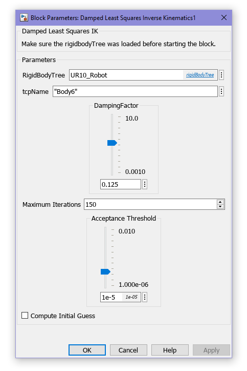

# Numerical Inverse Kinematics using On-Manifold Optimization

This repository contains the Matlab code and Simulink Block Library to implement numerical inverse kinematics inside a simulink project.<br/>
Invese kinematics are computed using the [Levenberg-Marquardt Algorithm](https://en.wikipedia.org/wiki/Levenberg%E2%80%93Marquardt_algorithm), also referred to as Damped Least Squares, which optimizes the gobal distance between the endeffector and the goal pose on the 3D rigid motion group SE(3).

This library includes the following features:

- _Auto-differentiation_ (i.e. computing the Jacobian) for arbitrary serial open chains.
- _MC sample based initialization_, that is no initial guess needs to be provided.
- _Customization of the damping factor_ via the Simulink block mask.
- _Custom weighting factors_ for the pose error via block input ports.

**Please remark** that this solver only optimizes a kinematic constraint and therefore does not take into account any kinetic properties of the serial open chain. This is experimental code, do not use in a production envirnoment.

## Setup and Quick Start

Besides the example code, the following files are absolutely required in order for the block to work:

- `DampedLeastSquaresIK.m` - the Level 2 S-Function that implements the solver.
- `dlsik_lib.slx` - the simulink block library.
- `adjointSE3.m` - computes the SE(3) Adjoint of a transform, used to transfer local twists to the Lie-Algebra
- `spaceJacobian` - computes the global interpretation of the Jacobian matrix used during optimization.
- `monteCarloInitialGuess.m` - generates an approximative initial guess using MC sampling.

### Simulink

To include the custom IK block into your simulink project, clone this repository directly into the project. The `dlsik_lib.slx` file contains the block relevant Simulink block. Open this file, then drag and drop the block into your Simulink project.

The input and output connections of the block are similar to that of the [Inverse Kinematics Block provided by MathWorks](https://de.mathworks.com/help/robotics/ref/inversekinematics.html). It only differs in terms of the configuration that needs to be done using the mask interface, which will be detailed further below. The following image displays an example setup of both blocks side-by-side.


For further details on the connection setup, please refer to the [official IK example](https://de.mathworks.com/help/robotics/ug/trace-end-effector-ik-simulink.html) provided by MathWorks.

#### Block Mask Parameters

In order for the block to work, more information is required.

- A reference to the [Rigid Body Tree](https://de.mathworks.com/help/robotics/ref/rigidbodytree.html) object.
- The name of the endeffector body, the frame transform of which is used as the plant state.
- The scalar value of the damping factor that is used to formulate the constraint.

Below is an example of the configuration that can be made for the block.



Experiments with the UR10 6DOF arm have shown fast convergence and sufficient results with a damping factor of `0.125`.

### Matlab Examples - Understanding the Code

In order to get a better understanding of what is happening underneath the hood, some standalone example scripts are provided.

- `simpleRobotTest.m` - which implements the LM optimization on _Example 6.1_ in _"Modern Robotics"_ [(Lynch and Park, 2017)](http://hades.mech.northwestern.edu/images/7/7f/MR.pdf).
- `ur10IKDemo.m` - loads the tree configuration of a UR10 and computes the IK of a preset pose.

You can modify one of the examples to load your own robot and get an idea on how to setup an IK solver for it.

## Misceral Information

### Indexing Offset for Auto-Differentiation

The only information required by the `spaceJacobian` function is a reference to the rigid body tree and its current joint-state.

```matlab
J = spaceJacobian(robot, articulation); % default way to compute the jacobian
```

However, in case your tree contains one or more inert bodies at the first indices, an indexing-offset can be passed to the function as well.

```matlab
J = spaceJacobian(robot, articulation, indexingOffset) % only begin indexing after the offset.
```

Note however, that the function will assume that all links following the offset will be articulated by joints, i.e. there aren't any inert bodies after the first link up until the endeffector.

### Explaining the IK Loop step-by-step

In order for an IK loop to work, there are two criteria that need to be predetermined before implementing an optimization procedure.

- The acceptable lower bound of the pose error (usually expressed by the weighted norm of the local twist).
- A maximum count of iterations to be performed, after which the optimization needs to stop.

The optimizer will then abort when either of these criteria are met. The following code snippet demonstrates the implementation of one such approach to optimization.

```matlab
%% numerical IK implementation example
Ad_T_sb0 = adjointSE3(T_sb0); % the adjoint matrix at the start
currDistance = norm(Ad_T_sb0 * errorTwist(T_sb0, T_sd)); % pose distance
minDistance = 1e-3; % consider the result converged if this distance is met
maxIterations = 5e3; % other wise break the loop after that many iterations
numIterations = 0; % used to count elapsed number of iterations
articulation = monteCarloInitialGuess(); % compute MC-sampled initial guess

% while the distance is still too large and the maximum iterations have
% not yet been exceeded ...
while currDistance > minDistance && numIterations < maxIterations
    % ... compute the change in articulation using the optimizer ...
    deltaArticulation = iterateIK(robot, articulation, tcpName, T_sd);
    % ... apply that change to the current articulation ...
    articulation = articulation + deltaArticulation;
    % ... apply the new state to the system ...
    tcpPose = getTransform(robot, articulation, tcpName);
    % ... update the current pose error and increase the iteration count...
    currDistance = norm(adjointSE3(tcpPose) * errorTwist(tcpPose, T_sd));
    numIterations = numIterations + 1;
end

% display the result of the optimization
disp("Exiting after " + numIterations + " iterations");
disp("Final error: " ...
    + norm(adjointSE3(tcpPose) * errorTwist(tcpPose, T_sd)));
```

Whereby the above example uses a function called `iterateIK`, which is implements the optimization algorithm. One such implementation (as is used in this library) is provided here.

```matlab
function deltaArticulation = iterateIK(robot, articulation, tcpName, targetPose)
    l = 0.125; % define a damping constant
    tcpPose = getTransform(robot, articulation, tcpName); % compute the current pose (system state)
    localError = errorTwist(tcpPose, targetPose); % the error twist in the local tangent space
    globalError = adjointSE3(tcpPose) * localError; % transform error to the lie-algebra
    J = spaceJacobian(robot, articulation); % compute the jacobian
    deltaArticulation = J.' / (J * J.' + l^2 * eye(6)) * globalError; % the damped least squares formula
end
```

For further details, refer to the provided examples and the literature mentioned below.

### Further Resources

#### Remarks

In this library, a manifold representation in SE(3) was chosen in favor of the reduced geometric form introduced in (Buss, 2009) in order to provide more generality and avoid the problem of gimbal lock that might arise when using Euler-angles. The Levenberg-Marquardt optimization algorithm was favored instead of the Newton-Rhapson Method - which is used by (Lynich and Park, 2017) - to guarantee stability in the neighborhood of local minima. Approximation and control is computed in the Lie-algebra se(3) instead of the local tangent space purely out of personal preference.

#### Sources

Below is a list of recommended readings about the topics of Lie-Groups, On-Manifold Optimization and Inverse Kinematics for serial manipulators.

- [A micro Lie Theory for state estimation in robotics](https://arxiv.org/abs/1812.01537), Solà, Deray and Atchuthan - a gentle introduction into Lie-groupds, specifically aimed at roboticists.
  - There exists a [complementary online lecture](https://www.youtube.com/watch?v=nHOcoIyJj2o) from one of the authors, aiming to provide an overview to the topic.
- [A tutorial on SE(3) transformation parameterizations and on-manifold optimization](https://ingmec.ual.es/~jlblanco/papers/jlblanco2010geometry3D_techrep.pdf), Blanco Claraco - an overview to the state-of-the-art landscape of on-manifold optimization techniques.
- [Modern Robotics - Mechanics, Planning and Control](http://hades.mech.northwestern.edu/images/7/7f/MR.pdf), Lynch and Park - a group-theoretic approach to dealing with problems in robot mechanics.
- [Introduction to Inverse Kinematics with Jacobian Transpose, Pseudoinverse and Damped Least Squares methods](http://graphics.cs.cmu.edu/nsp/course/15-464/Spring11/handouts/iksurvey.pdf), Buss - an overview of the Damped Least Squares approach to inverse kinematics for serial manipulators.
- Naive Lie Theory, Stillwell - a more in-depth and general mathematical discussion of various Lie-groups (it does not mention SE(3) but the math applies there just as well).
